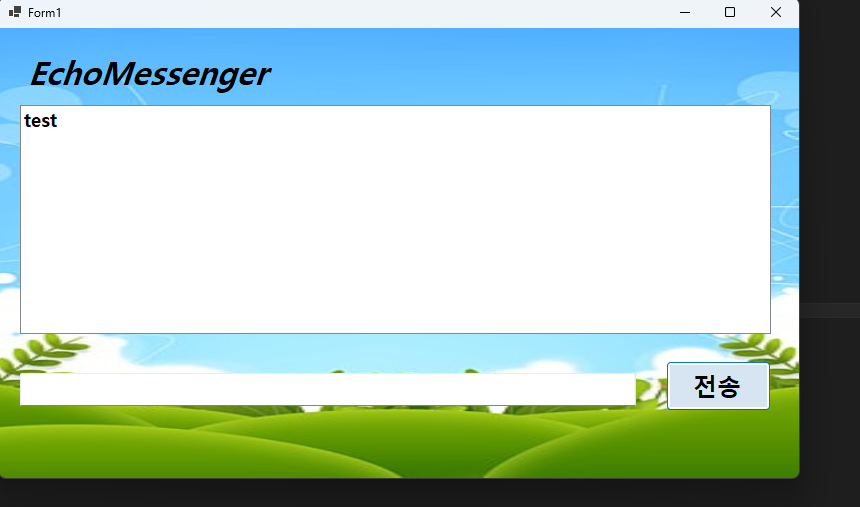
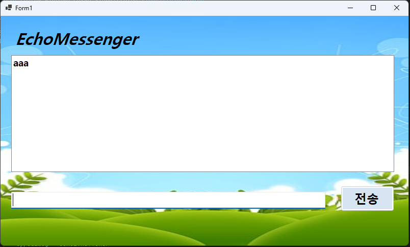
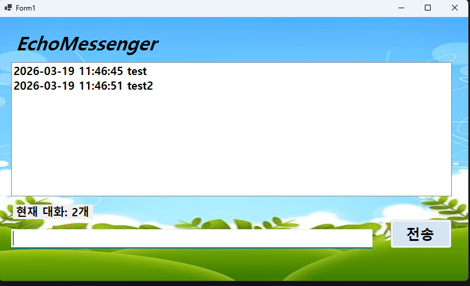
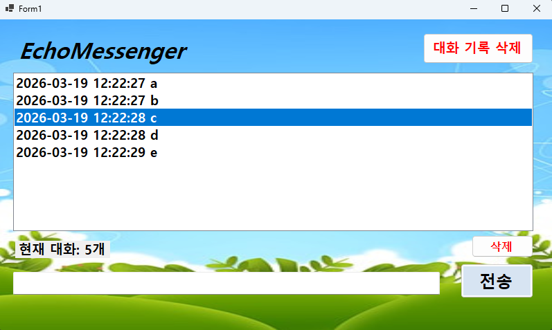
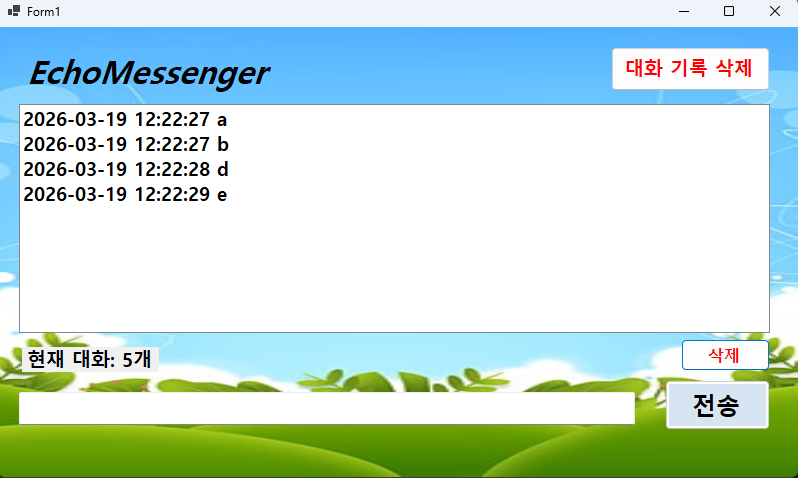
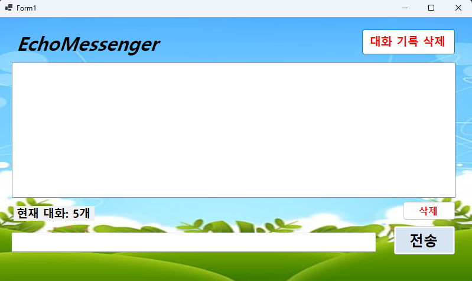
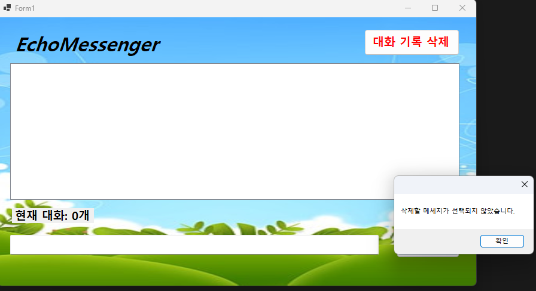
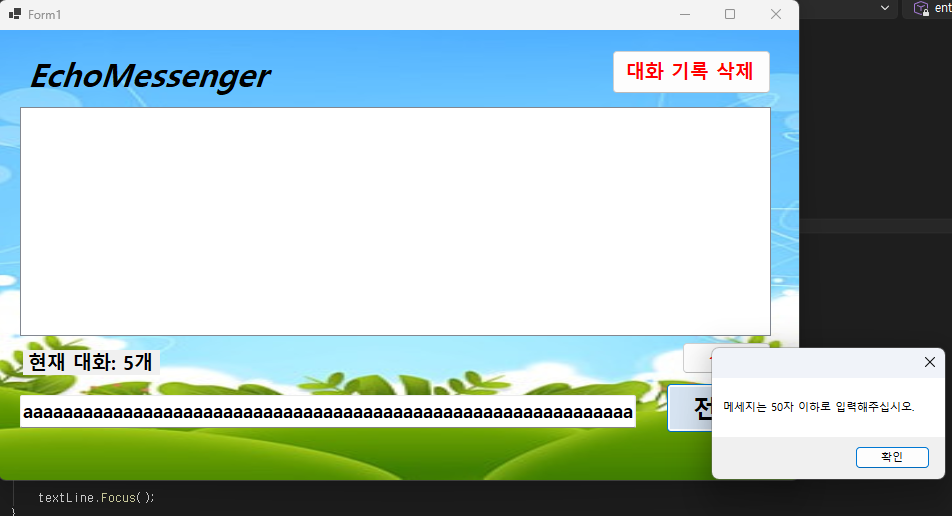

# EchoMessenger

# (C# 코딩) EchoMessenger

## 개요
- C# 프로그래밍 학습
- 1줄 소개: 메세지를 입력하고 이를 로그에 기록하는 메신저 프로그램
- 사용한 플랫폼:
  -C#, .NET Windows Forms, Visual Studio, GitHub
- 사용한 컨트롤:
  - Label, TextBox, ListBox, Button
- 사용한 기술과 구현한 기능:
  - Visual Studio를 이용하여 UI 구현
 

## 실행 화면 (과제1)
- 과제1 코드의 실행 스크린샷

- 과제 내용
  - Label(표시), TextBox(입력), Button(전송), ListBox(대화창)를 적절히 배치합니다.
  - 전송 버튼 클릭 시 TextBox의 텍스트를 ListBox의 항목(Items)으로추가합니다.
  - 추가 직후 TextBox의 내용을 비워(Clear) 다음 입력을 준비합니다.

- 구현 내용과 기능 설명
  - 입력창(TextBox)에 메세지를 입력하고 전송(Button)을 클릭하면 입력창(TextBox) 메세지는 지워지고 ListBox에 메세지가 추가되는 기능 구현
  - 대화창에는 입력된 메세지들이 순서대로 표시됨

## 실행 화면 (과제2)
- 과제2 코드의 실행 스크린샷

- 과제 내용
  - 전송 후에 마우스로 입력창을 다시 클릭하지 않아도 되도록 커서를 자동으로 입력창에 둡니다.
  - 마우스 클릭 대신 키보드의 Enter 키를 눌러도 메시지가 전송되도록 합니다.
  - 내용이 없는 빈 문자열이나 공백(Space)만 있을 때는 메시지가 전송되지 않도록 방지합니다.

- 구현 내용과 기능 설명
  - 전송 버튼을 클릭해도 입력창에 커서가 자동으로 위치하도록 Focus() 함수를 사용하여 구현
  - TextBox의 Keydown을 활용하여 Enter 키 입력 시 메시지가 전송되도록 구현
  - if else문을 사용하여 TextBox의 텍스트가 빈 문자열이거나 공백만 있을 때 메시지가 전송되지 않도록 구현

## 실행 화면 (과제3)
- 과제3 코드의 실행 스크린샷

- 과제 내용
  - 메시지 앞에 현재 시간을 자동으로 결합하여 리스트에 출력합니다.\
  - 현재 리스트에 쌓인 총 메시지 개수를 계산하여 하단 Label에 실시간으로 업데이트합니다.
  - 사용자가 입력한 메시지의 앞뒤 불필요한 공백을 Trim() 함수로 제거하여 저장합니다.

- 구현 내용과 기능 설명
  - DateTime.Now.ToString을 활용하여 현재 시간을 문자열로 변환하여 메시지 앞에 결합하여 ListBox에 출력하도록 구현
  - 전송 버튼을 클릭할 때마다 ListBox.Items.Count를 활용하여 현재 리스트에 쌓인 총 메시지 개수를 계산하여 하단 Label에 실시간으로 반영하도록 구현
  - TextBox.Text.Trim()을 활용하여 사용자가 입력한 메시지의 앞뒤 불필요한 공백을 제거하여 저장하도록 구현

## 실행 화면 (과제4)
- 과제4 코드의 실행 스크린샷

- 과제 내용
  - ListBox에서 특정 메시지를 마우스로 클릭하고 '삭제' 버튼을 누르면 해당 항목만 목록에서 제거합니다.(단, 선택하지 않고 삭제 시 발생하는 에러를 예외 처리해야 함)
  - '대화 기록 삭제' 버튼을 클릭하면 리스트의 모든 내용을 한번에 지웁니다.
  - 입력창에 글자 수를 50자로 제한하고, 초과 시 사용자에게 경고메시지를 띄우거나 전송을 차단합니다.

- 구현 내용과 기능 설명
  - ListBox.SelectedIndex를 활용하여 특정 메시지를 선택한 후 삭제 버튼을 클릭하면 해당 항목이 제거되도록 구현, 선택하지 않고 삭제 버튼을 클릭할 때 발생하는 에러는 if else문으로 예외 처리하여 MessageBox.Show를 활용하여 경고 메세지을 띄우도록 구현
  - '대화 기록 삭제' 버튼을 클릭하면ListBox.Items.Clear를 사용하여 리스트의 모든 내용을 지우도록 구현
  - 입력창에 글자를 50자 초과하여 전송 시 MessageBox.Show를 활용하여 경고 메세지를 띄우고 전송을 차단하도록 구현

## 구현하면서 느낀 점

- ListBox의 항목을 선택하는 기능을 활용하며 ListBox의 함수에 대해 더 잘 알게 되었습니다.
- 예외 처리를 하면서 if else문과 MessageBox.Show를 활용하여 사용자에게 경고 메세지를 띄우는 방법을 배웠습니다.
- Trim 함수를 이용하며 쉽게 문자열의 앞뒤 공백을 제거할 수 있다는 것을 알게 되었습니다.